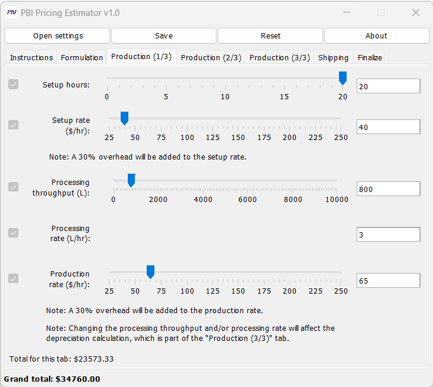
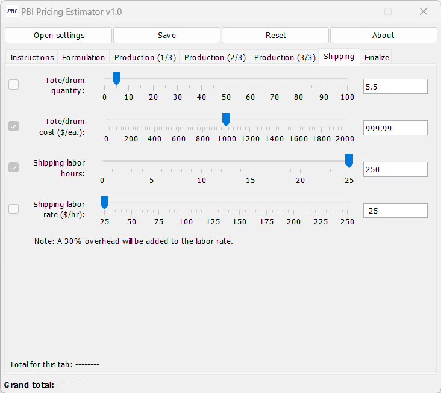
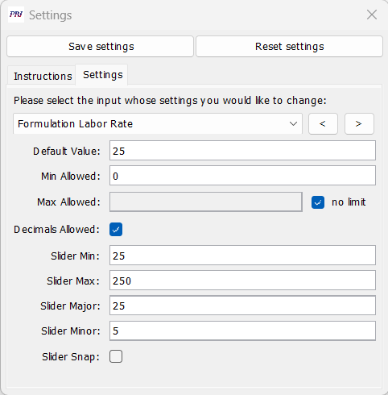
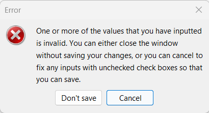
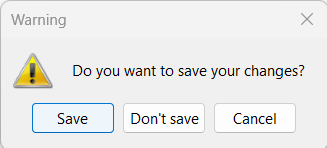
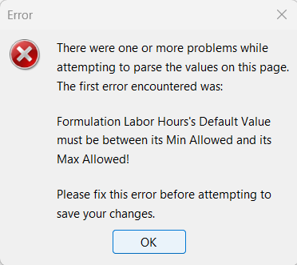

# PBI Pricing Estimator

A GUI-based application developed for Pressure BioSciences, Inc. (PBI)
to estimate the production cost and sale price of potential product
formulations.

### Important Notes

- The code for this application is proprietary and cannot be released
publicly. However, I have been given permission to publish this project
overview, which includes screenshots of the application, for my
portfolio.
- This project was completed during July and August 2022 using Java and
the Swing GUI library.

### Project Overview

The application enables the user to enter values for 21 different
calculation inputs relating to the production and sale of a potential
product, and uses these values to calculate the total cost of the
product. (This can be interpreted as either the production cost or the
desired selling price of the product, depending on whether a nonzero
value is given for the preferred gross margin.) In addition to saving
employees time compared to performing such calculations by hand
(especially when modifying only a few input values between
calculations), the program also enables users to see in real time how
changing the value of a particular input affects the final cost, as
calculation totals visibly update in real time as an input slider is
dragged or a new number is entered into a text field.

The current input values can be saved so as to be automatically reloaded
when the application is reopened; the save file, which is created in the
.csv file format, also
serves as a means of exporting calculation data (inputs and results)
from the program. The application also allows default
values, input validation rules, and other input-related options to be
customized and saved using the settings window. The Features section
below contains more detailed information about many of these aspects of
the program.

### Features

The main application window, as shown in the screenshot below, includes
one tab with instructions
explaining how to use the program, and six tabs for entering calculation
inputs. Additionally, buttons at the top of the window can be used to
open the settings window, save the current calculation inputs, reset the
inputs to their default values, or display an informational "About"
dialog. At the bottom of the window, a subtotal calculated from the
inputs in the
current tab and a total price estimate from all tabs are displayed.
These totals are updated in real time as input values are changed.

This screenshot shows one of the calculation tabs. Some inputs can
be entered using a slider or a text field, and others only using a text
field. For inputs with sliders, dragging the slider updates the value in
the text field in real time, and vice versa. Input validation parameters
and slider settings can be customized in the settings window; the
uneditable checkbox to the left of each input shows whether the value
entered for that input is valid. Some
inputs also include notes to provide additional information about how
they will contribute to the final calculation.

In this screenshot from another calculation tab, text fields are used to
enter values for the second and third inputs ("Tote/drum cost" and
"Shipping labor hours") that would be impossible to enter using the
sliders — a decimal for the second input, and a value outside the
range of the slider for the third input. The first and last inputs
demonstrate the calculator's input validation capabilities. In the
settings window, decimals were disallowed for the tote/drum quantity and
a minimum value of 0 was set for the shipping labor rate, so the values
entered for these inputs are considered invalid. As a result, the
checkbox to
the left of each of these inputs is unchecked to signify that the values
entered for the inputs are invalid, and dashes are used for the tab
total and grand total to indicate that they are unable to be calculated.

This is a screenshot of the settings window when editing the settings
for the Formulation Labor Rate input. Buttons to save changes made to
the settings and reset the settings to their default values are located
at the top of the window; the rest of the window has two tabs, one with
instructions explaining what the different settings mean and one that
allows the user to view and edit the settings themselves. Within the
"Settings" tab, the user can select the input for which they would like
to view or edit the settings either by using the input dropdown to
select
it directly, or by using the left and right buttons next to the dropdown
to move between inputs in the same order that they appear in the main
calculator window. The input shown in the screenshot ("Formulation labor
rate") is a slider input; non-slider inputs have only the first four
settings displayed. The first setting controls the initial value of the
input when the calculator is first started or is reset, and the next
three settings control input validation rules that are applied
regardless of how an input's value is entered: the minimum value
allowed, the maximum value allowed (which can be unlimited), and whether
decimals should be allowed. The last five settings control slider
parameters: the minimum value displayed, the maximum value displayed,
the distance between major ticks (which are large and numbered), the
distance between minor ticks (which are small and unnumbered), and
whether the slider should snap to the nearest tick value when the mouse
is released.

Multiple dialogs were also created to notify the user of errors and to
remind them to save their work if unsaved changes are detected when the
user attempts to close the window. A few examples are shown below.

Above: dialog that is shown when the user attempts to close the main
calculator window with invalid input values

Above: dialog that is shown when the user attempts to close the main
calculator or settings window with unsaved (valid) changes

Above: dialog that is shown when the user attempts to save invalid
changes in the settings window